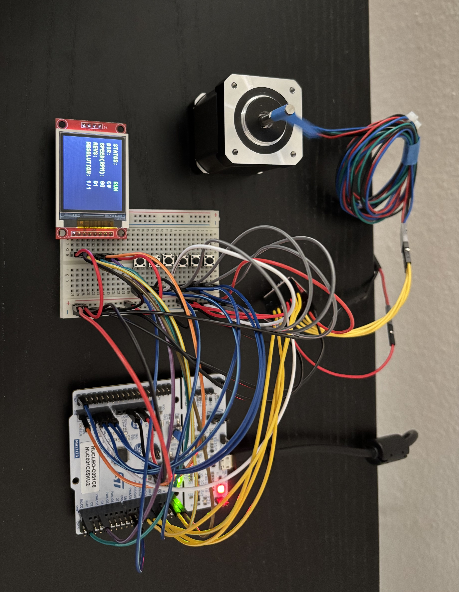
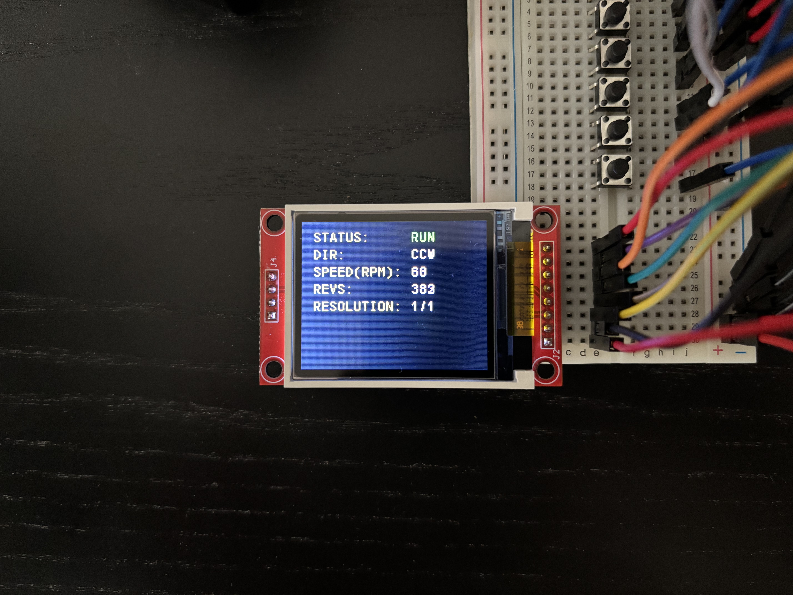

# Real-Time Stepper Motor Control System

A multi-threaded stepper motor controller built on an STM32C031C6 (ARM Cortex-M0+) running FreeRTOS. The system decouples step-pulse generation, safety monitoring, user input, and display rendering into independent prioritized tasks rather than relying on a sequential `while(1)` loop with blocking delays.

## Overview

The controller drives a NEMA17 stepper motor through an A4988 driver, with runtime-configurable direction, speed (60-300 RPM), and a microstep resolution (full to 1/16 step). Five polled push buttons adjust motion parameters, which are passed to the motor controller through a thread-safe FreeRTOS queue. A dedicated EXTI interrupt handles emergency stop with sub-millisecond latency, immediately halting pulse generation independent of the motor task's scheduling.

Step pulses are generated by a hardware timer interrupt (TIM16) rather than a blocking software loop, decoupling precise microsecond-level pulse timing from the millisecond-resolution RTOS scheduler. The motor control task runs a linear acceleration ramp on a fixed `vTaskDelayUntil()` period, adjusting the step generator's interval as the ramped speed changes — preventing motor stalling without relying on blocking delays for motor control. An ST7735 TFT displays live direction, RPM, and microstep resolution, with SPI bus access guarded by a mutex.

**Hardware:** STM32C031C6, NEMA17 stepper motor, A4988 driver, ST7735 128 x 160 TFT display, 12V 2A power supply, 6 push buttons (5 polled control + 1 interrupt E-stop)

## Architecture

| Task          | Priority    | Responsibility                                                              |
| ------------- | ----------- | --------------------------------------------------------------------------- |
| Safety        | 4 (highest) | Blocks on event group; halts step generation on E-stop                      |
| Motor Control | 3           | Consumes command queue, computes acceleration ramp, reprograms step timer   |
| UI            | 1           | Polls buttons with edge detection, sends commands to queue, updates display |

## Modules

### `A4988/`

- `A4988.h` / `A4988.c` — Custom-built stepper motor driver. Handle-based API wrapping GPIO control of STEP/DIR/MS1/MS2/MS3 pins. Validates and applies direction (`A4988SetDirection`), microstep resolution (`A4988SetMicrostep`), and speed (`A4988SetSpeedRPM`); generates single step pulses (`A4988Step`); computes step interval from current RPM and microstep resolution (`A4988GetStepIntervalUs`).

### `Utils/`

- `step_generator.h` / `step_generator.c` — Hardware-timer-driven pulse generator. Wraps a generic `TIM_TypeDef*` to fire step pulses from a timer update interrupt at a runtime-configurable interval, decoupling pulse timing from RTOS scheduling. Provides start/stop/interval control and an ISR handler.
- `delay.h` / `delay.c` — Microsecond-resolution busy-wait delays using a free-running hardware timer counter, with wraparound-safe elapsed-time calculation. Used for the A4988's minimum STEP pulse width.
- `controls.h` / `controls.c` — Button input with edge detection. Returns true only on the press transition (not held state), using caller-supplied per-button state.
- `motion_command.h` — Queue payload struct carrying direction, microstep, speed, and target steps between the UI and motor control tasks.
- `int_string.h` / `int_string.c` — Lightweight integer-to-string conversion for display rendering, avoiding `printf` overhead.

### `ST7735/`

- `ST7735.h` / `ST7735.c` — Application-level display layer. Draws static labels once at init (`ST7735Init`) and refreshes live motion values in place (`ST7735Update`).
- `ST7735_library.h` / `ST7735_library.c` — Low-level ST7735 driver. Register-level SPI transmission, display initialization command sequences, rotation/address-window handling, and text/rectangle primitives.
- `fonts.h` / `fonts.c` — Bitmap font data.

### `Core/Src/`

- `app_freertos.c` — Task definitions, FreeRTOS object creation (queue, event group, mutex), driver initialization, and task creation.
- `main.c` — Peripheral initialization (GPIO, SPI1, TIM3, TIM16), clock configuration, display init, and scheduler startup.
- `stm32c0xx_it.c` — Interrupt handlers: TIM16 step-pulse ISR and EXTI2 emergency-stop ISR.

## Demo

    
    
    

